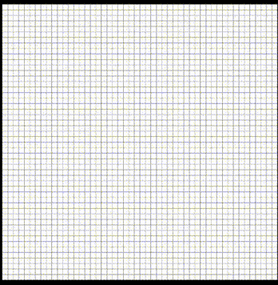

# AStar-Pathfinding-Visualizer

A* pathfinding algorithm visualizer, made in Python and Pygame.
This version lets the user select the start and end point in a 50x50 grid,
as well as creating walls (and deleting them) , to make the algorithm visualization more
interesting.
Once started (spacebar), the algorithm will start looking for the optimal path between
the two points, and highlight it in yellow.
The grid can be resetted with "C".

--------------------------------

PythonとPygameで作ったA*アルゴリズムです。
このバージョンでユーザーはスタート(A)とエンド(B)ポイントを選択出来るし、マウスのクリックで壁を
作れることもできます。そうするとアルゴリズムっと面白くなります。
Spacebarを押すと、アルゴリズムはスタートして、AからＢまでの一番短い道を探して、黄色い線で表示します。
'C'を押すとグリッドがリセットします。
